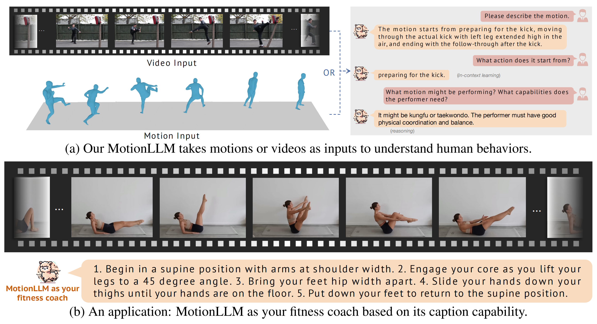
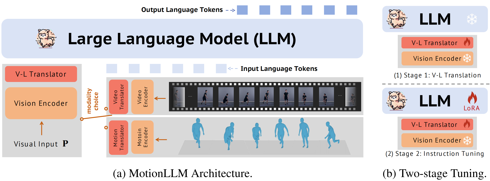

# MotionLLM: Understanding Human Behaviors from Human Motions and Videos


[Ling-Hao Chen](https://lhchen.top)<sup>😎 1, 3</sup>, 
[Shunlin Lu](https://shunlinlu.github.io)<sup>😎 2, 3</sup>, 
[Ailing Zeng](https://ailingzeng.sit)<sup>3</sup>, 
[Hao Zhang](https://haozhang534.github.io/)<sup>3, 4</sup>, 
[Benyou Wang](https://wabyking.github.io/old.html)<sup>2</sup>, 
[Ruimao Zhang](http://zhangruimao.site)<sup>2</sup>, 
[Lei Zhang](https://leizhang.org)<sup>🤗 3</sup>

<sup>😎</sup>Co-first author. Listing order is random. 
<sup>🤗</sup>Corresponding author.

<sup>1</sup>Tsinghua University, 
<sup>2</sup>School of Data Science, The Chinese University of Hong Kong, Shenzhen (CUHK-SZ), 
<sup>3</sup>International Digital Economy Academy (IDEA),
<sup>4</sup>The Hong Kong University of Science and Technology

<p align="center">
  <a href='https://arxiv.org/abs/2405.20340'>
  
  </a> 
  <a href='https://arxiv.org/pdf/2405.20340.pdf'>
  
  </a> 
  <a href='https://lhchen.top/MotionLLM'>
  </a> 
  <a href='https://research.lhchen.top/blogpost/motionllm'>
    </a>
  <a href='https://github.com/IDEA-Research/MotionLLM'>
  </a> 
  <a href='LICENSE'>
  
  </a> 
  <a href="" target='_blank'>
  
  </a> 
</p>

# 📰 News

- **[2024-05-31]: Paper, demo, and codes are released.** 


# 🤩 Abstract

This study delves into the realm of multi-modality (i.e., video and motion modalities) human behavior understanding by leveraging the powerful capabilities of Large Language Models (LLMs). Diverging from recent LLMs designed for video-only or motion-only understanding, we argue that understanding human behavior necessitates joint modeling from both videos and motion sequences (e.g., SMPL sequences) to capture nuanced body part dynamics and semantics effectively. In light of this, we present MotionLLM, a straightforward yet effective framework for human motion understanding, captioning, and reasoning. Specifically, MotionLLM adopts a unified video-motion training strategy that leverages the complementary advantages of existing coarse video-text data and fine-grained motion-text data to glean rich spatial-temporal insights. Furthermore, we collect a substantial dataset, MoVid, comprising diverse videos, motions, captions, and instructions. Additionally, we propose the MoVid-Bench, with carefully manual annotations, for better evaluation of human behavior understanding on video and motion. Extensive experiments show the superiority of MotionLLM in the caption, spatial-temporal comprehension, and reasoning ability.

## 🤩 Highlight Applications



## 🔧 Technical Solution



## 💻 Try it

We provide a simple online [demo](https://demo.humotionx.com/) for you to try MotionLLM. Below is the guidance to deploy the demo on your local machine.

### Step 1: Set up the environment

```bash
pip install -r requirements.txt
```

### Step 2: Download the pre-trained model


<details>
  <summary><b> 2.1 Download the LLM </b></summary>

Please follow the instruction of [Lit-GPT](https://github.com/Lightning-AI/litgpt) to prepare the LLM model (vicuna 1.5-7B). These files will be: 
```bah
./checkpoints/vicuna-7b-v1.5
├── generation_config.json
├── lit_config.json
├── lit_model.pth
├── pytorch_model-00001-of-00002.bin
├── pytorch_model-00002-of-00002.bin
├── pytorch_model.bin.index.json
├── tokenizer_config.json
└── tokenizer.model
```

If you have any confusion, we will update a more detailed instruction in couple of days.

</details>

<details>
  <summary><b> 2.2 Dowload the LoRA and the projection layer of the MotionLLM </b></summary>

We now release one versions of the MotionLLM checkpoints, namely `v1.0` (download [here](https://drive.google.com/drive/folders/1d_5vaL34Hs2z9ACcMXyPEfZNyMs36xKx?usp=sharing)). Opening for the suggestions to Ling-Hao Chen and Shunlin Lu. 

```bash
wget xxx
```
Keep them in a folder named and remember the path (`LINEAR_V` and `LORA`).

</details>

### 2.3 Run the demo 

```bash
GRADIO_TEMP_DIR=temp python app.py --lora_path $LORA --mlp_path $LINEAR_V
```
If you have some error in downloading the huggingface model, you can try the following command with the mirror of huggingface.
```bash
HF_ENDPOINT=https://hf-mirror.com GRADIO_TEMP_DIR=temp python app.py --lora_path $LORA --mlp_path $LINEAR_V
```
The `GRADIO_TEMP_DIR=temp` defines a temporary directory as `./temp` for the Gradio to store the data. You can change it to your own path.

After thiess, you can open the browser and visit the local host via the command line output reminder. If it is not loaded, please change the IP address as your local IP address (via command `ifconfig`).


## 💼 To-Do

- [x] Release the video demo of MotionLLM.
- [ ] Release the motion demo of MotionLLM.
- [ ] Release the MoVid dataset and MoVid-Bench.
- [ ] Release the tuning instruction of MotionLLM.


## 💋 Acknowledgement


The author team would like to deliver many thanks to many people. Qing Jiang helps a lot with some parts of manual annotation on MoVid Bench and resolves some ethics issues of MotionLLM. Jingcheng Hu provided some technical suggestions for efficient training. Shilong Liu and Bojia Zi provided some significant technical suggestions on LLM tuning. Jiale Liu, Wenhao Yang, and Chenlai Qian provided some significant suggestions for us to polish the paper. Hongyang Li helped us a lot with the figure design. Yiren Pang provided GPT API keys when our keys were temporarily out of quota. The code is on the basis of [Video-LLaVA](https://github.com/PKU-YuanGroup/Video-LLaVA), [HumanTOMATO](https://lhchen.top/HumanTOMATO/), [MotionGPT](https://github.com/qiqiApink/MotionGPT). [lit-gpt](https://github.com/Lightning-AI/litgpt), and [HumanML3D](https://github.com/EricGuo5513/HumanML3D). Thanks to all contributors! 


## 📚 License

This code is distributed under an [IDEA LICENSE](LICENSE). Note that our code depends on other libraries and datasets which each have their own respective licenses that must also be followed.


If you have any question, please contact at: thu [DOT] lhchen [AT] gmail [DOT] com AND shunlinlu0803 [AT] gmail [DOT] com.


## 📜 Citation
```bash
@article{chen2024motionllm,
  title={MotionLLM: Understanding Human Behaviors from Human Motions and Videos},
  author={Chen, Ling-Hao and Lu, Shunlin and Zeng, Ailing and Zhang, Hao and Wang, Benyou and Zhang, Ruimao and Zhang, Lei},
  journal={arXiv preprint arXiv:2405.20340},
  year={2024}
}
```